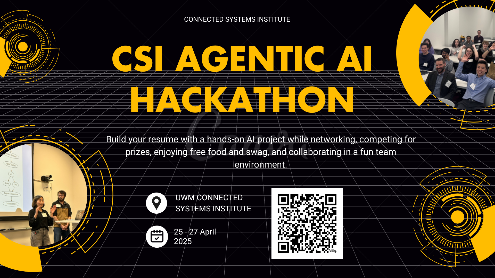

# Hackathon Management System with AI Agents

A comprehensive platform for organizing and managing hackathons with the help of intelligent AI agents. This application streamlines every aspect of planning, running, and managing hackathons with intelligent AI-powered assistance.



## Features

- **AI-Powered Agents**: Specialized agents for registration, team formation, scheduling, judging, and more
- **Participant Management**: Register participants, form teams, and track attendance
- **Hackathon Organization**: Create and manage multiple hackathons with detailed information
- **Real-time Assistance**: Get automated help for common tasks and questions
- **Role-based Access**: Different interfaces for participants, mentors, and organizers
- **Interactive Dashboard**: Track progress, manage tasks, and get insights
- **Responsive Design**: Works seamlessly on desktop and mobile devices

## AI Agents

This system includes several specialized AI agents to help manage different aspects of hackathons:

- **Registration Agent**: Streamlines participant signup, validates data, and suggests skills
- **Team Formation Agent**: Matches participants based on complementary skills and interests
- **Scheduling Agent**: Creates optimized event timelines and sends reminders
- **Submission Agent**: Processes project submissions and provides feedback
- **Judging Agent**: Facilitates fair evaluation of projects
- **Communication Agent**: Manages notifications and updates
- **Coordinator Agent**: Orchestrates communication between other agents

## Technology Stack

- **Frontend**: React, Redux, Tailwind CSS, React Router
- **Backend**: Node.js, Express
- **AI**: Azure OpenAI Service
- **Build Tools**: Vite, PostCSS
- **Styling**: Tailwind CSS, Custom CSS
- **Deployment**: Docker, Nginx

## Getting Started

### Prerequisites

- Node.js (v14 or later)
- npm or yarn
- Git

### Installation

1. Clone the repository
   ```bash
   git clone https://github.com/Dally101/Hackthehack.git
   cd Hackthehack
   ```

2. Install dependencies
   ```bash
   npm install
   # or
   yarn install
   ```

3. Start the development server
   ```bash
   npm run dev
   # or
   yarn dev
   ```

4. Open your browser and navigate to `http://localhost:3001`

### Building for Production

To create a production build:

```bash
npm run build
# or
yarn build
```

## Usage

### For Participants

1. Register for an account by clicking "Sign Up" or "Register"
2. Browse available hackathons on the Hackathons page
3. Register for a hackathon by clicking on it and selecting "Register"
4. Create or join a team
5. Submit your project before the deadline

### For Organizers

1. Click "Start Organizing" to create an organizer account
2. After logging in, use the dashboard to create a new hackathon
3. Configure hackathon details, timeline, prizes, and judging criteria
4. Monitor registrations, teams, and submissions
5. Use the AI agents to automate tasks and get assistance

### For Mentors

1. Register as a mentor through the sign-up page
2. Browse hackathons you're mentoring
3. View teams and provide feedback
4. Schedule mentor sessions with teams

## Screenshots

- Home Page: Showcases AI agents and main features
- Hackathon Listing: Browse all available hackathons
- Hackathon Detail: View comprehensive information about each hackathon
- Registration: User-friendly registration process
- Dashboard: Centralized management interface

## Contributing

Contributions are welcome! Please feel free to submit a Pull Request.

1. Fork the repository
2. Create your feature branch (`git checkout -b feature/amazing-feature`)
3. Commit your changes (`git commit -m 'Add some amazing feature'`)
4. Push to the branch (`git push origin feature/amazing-feature`)
5. Open a Pull Request

## License

This project is licensed under the MIT License - see the LICENSE file for details.

## Contact

Project Link: [https://github.com/Dally101/Hackthehack](https://github.com/Dally101/Hackthehack)

---

Built with ❤️ using React and Azure OpenAI
